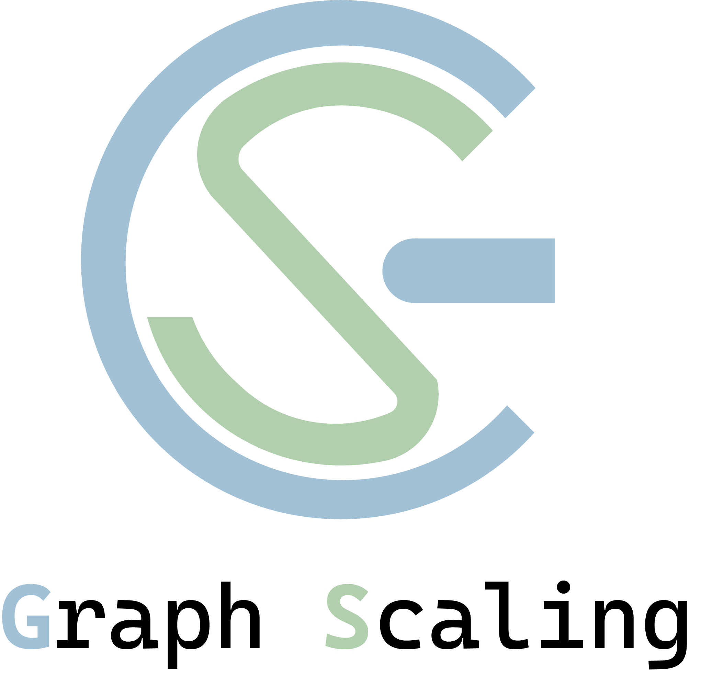

# Awesome-Graph-Scaling
  

     

## Scope of Graph Scaling
Given that graph data consists of a massive number of nodes and their relationships,  **Graph Scaling (GS)** solves the problem of: How to condense large-scale graphs into **smaller** yet **informative** ones.

## How can this repository be of service
This repository contains a list of papers who shares a common motivation of GS, including methods of graph condensation, reduction, summarization, etc.; We categorize them based on their aspect of making scaled graphs **informative**, i.e., what information of the original graph was designed to preserve, the graph properties (graph guided) or the trained models' capabilities (model guided). The detailed statistic of the commonly used datasets can be found after the paper list. Previously, this repository contained a paper list of **Graph Condensation**, which has been merged within the scope of graph scaling. The previous version can be found at the bottom of this file.

We will make this list updated. If you found any error or any missed paper, please don't hesitate to open an issue or pull request. 

## Paper List

**:triangular_flag_on_post: Our survey paper [Learning to Reduce the Scale of Large Graphs: A Comprehensive Survey](http://dx.doi.org/10.1145/3729427) has been accepted for publication in the Transactions on Knowledge Discovery from Data. We are looking forward to any comments or discussions on this topic :)** 

|Category |   Paper    |  Method  |  Conference  |  Code |
| :------:|  :---------  | :------:  | :------: | :------: |
|Graph Guided | [Graph reduction with spectral and cut guarantees](https://arxiv.org/pdf/2211.07136.pdf) | GC | JMLR 2019 | [Python](https://github.com/loukasa/graph-coarsening/tree/v1.1) |
|Graph Guided | [Graph coarsening with preserved spectral properties](https://arxiv.org/abs/1802.04447) | SGC | AISTATS 2020 |  |
|Graph Guided | [A unifying framework for spectrum-preserving graph sparsification and coarsening](https://proceedings.neurips.cc/paper/2019/hash/cd474f6341aeffd65f93084d0dae3453-Abstract.html) | ReduceG | NIPS 2019 | [Python](https://github.com/TheGravLab/A-Unifying-Framework-for-Spectrum-Preserving-Graph-Sparsification-and-Coarsening) |
|Graph Guided | [Scaling up graph neural networks via graph coarsening](https://arxiv.org/pdf/2106.05150.pdf) | SCAL | KDD 2021 | [Pytorch](https://github.com/szzhang17/Scaling-Up-Graph-Neural-Networks-Via-Graph-Coarsening) |
|Graph Guided | [GraphZoom: A multi-level spectral approach for accurate and scalable graph embedding](https://arxiv.org/pdf/1910.02370.pdf) | GraphZoom | ICLR 2020 | [Python](https://github.com/cornell-zhang/GraphZoom) |
|Graph Guided | [Graph coarsening with preserved spectral properties](https://arxiv.org/pdf/1802.04447.pdf) | SC | ICAIS 2020 | [Python](https://github.com/yuj-umd/spectral-coarsening) |
|Graph Guided | [Mile: A multi-level framework for scalable graph embedding](https://ojs.aaai.org/index.php/ICWSM/article/view/18067) | MILE | AAAI 2021 | [Python](https://github.com/jiongqian/MILE) |
|Graph Guided | [Featured graph coarsening with similarity guarantees](https://proceedings.mlr.press/v202/kumar23a.html) | FGC | ICML 2023 | - |
|Graph Guided | [Training-free Heterogeneous Graph Condensation via Data Selection](https://arxiv.org/pdf/2412.16250) | FreeHGC | Arxiv 2024 | [Pytorch](https://github.com/PKU-DAIR/FreeHGC) |
|Graph Guided | [Cat: Balanced continual graph learning with graph condensation](https://arxiv.org/abs/2309.09455) | CaT | ICDM 2023 | [Pytorch](https://github.com/superallen13/CaT-CGL) |
|Graph Guided | [Unsupervised learning of graph hierarchical abstractions with differentiable coarsening and optimal transport](https://ojs.aaai.org/index.php/AAAI/article/view/17072) | OTC | AAAI 2021 | [Pytorch](https://github.com/matenure/OTCoarsening) |
|Modle Guided | [Graph coarsening via convolution matching for scalable graph neural network training](https://arxiv.org/abs/2312.15520) | ConvMatch | Arxiv 2023 | [Pytorch](https://github.com/amazon-science/convolution-matching) |
|Modle Guided | [Graph Condensation via Receptive Field Distribution Matching](https://arxiv.org/abs/2206.13697) | GCDM | Arxiv 2022 | - |
|Modle Guided | [Rethinking and Accelerating Graph Condensation: A Training-Free Approach with Class Partition](https://arxiv.org/pdf/2405.13707) | CGC | Arxiv 2024 | [Pytorch](https://github.com/XYGaoG/CGC) |
|Modle Guided | [Kernel Ridge Regression-Based Graph Dataset Distillation](https://dl.acm.org/doi/abs/10.1145/3580305.3599398) | KiDD | KDD 2023 | [Pytorch](https://github.com/pricexu/KIDD) |
|Modle Guided | [Self-Supervised Learning for Graph Dataset Condensation](https://dl.acm.org/doi/pdf/10.1145/3637528.3671682) | SGDC | KDD 2024 | [Pytorch](https://github.com/wyx11112/SGDC) |
|Modle Guided | [Graph condensation for open-world graph learning](https://dl.acm.org/doi/pdf/10.1145/3637528.3671917) | OpenGC | KDD 2024 | - |
|Modle Guided | [TCGU: Data-centric Graph Unlearning based on Transferable Condensation](https://arxiv.org/pdf/2410.06480) | TCGU | Arxiv 2024 | - |
|Modle Guided | [Simple graph condensation](https://link.springer.com/chapter/10.1007/978-3-031-70344-7_4) | SimGC | ECML PKDD 2024 | [Pytorch](https://github.com/BangHonor/SimGC) |
|Modle Guided | [Backdoor graph condensation](https://arxiv.org/pdf/2407.11025) | BGC | Arxiv 2024 | - |
|Modle Guided | [FedGKD: Unleashing the Power of Collaboration in Federated Graph Neural Networks](https://arxiv.org/abs/2309.09517) | FedGKD | Arxiv 2023 | - |
|Modle Guided | [Fast graph condensation with structure-based neural tangent kernel](https://arxiv.org/abs/2310.11046) | GC-SNTK | Arxiv 2023 | - |
|Modle Guided | [Structure-free Graph Condensation: From Large-scale Graphs to Condensed Graph-free Data](https://arxiv.org/abs/2306.02664) | SFGC | NIPS 2023 | [Pytorch](https://github.com/Amanda-Zheng/SFGC) |
|Modle Guided | [Condensing Graphs via One-Step Gradient Matching](https://dl.acm.org/doi/abs/10.1145/3534678.3539429) | DosCond | KDD 2022 | [Pytorch](https://github.com/ChandlerBang/GCond) |
|Modle Guided | [Graph condensation for graph neural networks](https://arxiv.org/abs/2110.07580) | GCond | ICLR 2021 | [Pytorch](https://github.com/ChandlerBang/GCond) |
|Modle Guided | [Tinygraph: joint feature and node condensation for graph neural networks](https://arxiv.org/pdf/2407.08064) | TinyGraph  | Arxiv 2024 | - |
|Modle Guided | [Federated Graph Condensation with Information Bottleneck Principles](https://arxiv.org/pdf/2405.03911) | FGC  | Arxiv 2024 | - |
|Modle Guided | [RobGC: Towards Robust Graph Condensation](https://arxiv.org/pdf/2406.13200) | RobGC    | Arxiv 2024 | - |
|Modle Guided | [Attend who is weak: Enhancing graph condensation via cross-free adversarial training](https://arxiv.org/abs/2311.15772) | GroC | Arxiv 2023 | - |
|Modle Guided | [Faster Hyperparameter Search for GNNs via Calibrated Dataset Condensation](https://openreview.net/forum?id=ohQPU2G3r3C) | HCDC | OpenReview 2023 | - |
|Modle Guided | [Multiple sparse graphs condensation](https://www.sciencedirect.com/science/article/abs/pii/S0950705123006548) | MSGC | Knowledge-Based Systems 2023 | - |
|Hybrid | [Graph condensation for inductive node representation learning](https://arxiv.org/pdf/2307.15967) | Mcond | Arxiv 2023 | - |
|Hybrid | [Does graph distillation see like vision dataset counterpart?](https://arxiv.org/abs/2310.09192) | SGDD | NIPS 2023 | [Pytorch](https://github.com/RingBDStack/SGDD) |
|Hybrid | [Bi-Directional Multi-Scale Graph Dataset Condensation via Information Bottleneck](https://arxiv.org/pdf/2412.17355) | BiMSGC | Arxiv 2024 | [Pytorch](https://github.com/RingBDStack/BiMSGC) |
|Hybrid | [Contrastive Graph Condensation: Advancing Data Versatility through Self-Supervised Learning](https://arxiv.org/pdf/2411.17063) | CTGC  | Arxiv 2024 | - |
|Hybrid | [Graph condensation via eigenbasis matching](https://arxiv.org/abs/2310.09202) | GCEM | Arxiv 2023 | - | 

## Benchmark Dataset Statics

In order to facilitate further experimental research in the field, we have compiled a dataset of commonly used GS methods, with links to jump directly to the specific methods.

### Single Graph

| Dataset                                                      | #Nodes    | #Edges      | #Features | #Classes | Type                  |
| ------------------------------------------------------------ | --------- | ----------- | --------- | -------- | --------------------- |
| [Cora](https://arxiv.org/pdf/2110.07580.pdf)                 | 2,708     | 5,429       | 1,433     | 7        | Citation              |
| [CoraFull](https://arxiv.org/pdf/2309.09455.pdf)             | 19,793    | 130,622     | 8,710     | 70       | Citation              |
| [Citeseer](https://arxiv.org/pdf/2110.07580.pdf)             | 3,327     | 4,732       | 3,703     | 6        | Citation              |
| [Citeseer-L](https://arxiv.org/pdf/2310.09192.pdf)           | 3,327     | 4,732       | 3,703     | 2        | Citation              |
| [DBLP](https://arxiv.org/pdf/2106.05150.pdf)                 | 17,716    | 52,867      | 1,639     | 4        | Citation              |
| [DBLP-large](https://arxiv.org/pdf/2310.09192.pdf)           | 26,128    | 105,734     | 4,057     | 2        | Citation              |
| [Coauthor Physics(Co-phy)](https://arxiv.org/pdf/2106.05150.pdf) | 34,493    | 247,692     | 8,415     | 5        | Citation              |
| [OGBNArxiv(Arixiv)](https://arxiv.org/pdf/2110.07580.pdf)    | 169,343   | 1,166,243   | 128       | 40       | Citation              |
| [Pubmed](https://arxiv.org/pdf/2206.07746.pdf)               | 19,717    | 44,338      | 500       | 3        | Citation              |
| [OGBLCitation2](https://arxiv.org/pdf/2312.15520.pdf)        | 2,927,963 | 30,561,187  | 128       | N/A      | Citation              |
| [ACM](https://proceedings.mlr.press/v202/kumar23a/kumar23a.pdf) | 3,025     | 13,128      | 1,870     | N/A      | Citation              |
| [Friendster](https://arxiv.org/pdf/1910.02370.pdf)           | 7,944,949 | 446,673,688 | N/A       | 5000     | Social                |
| [Flickr](https://arxiv.org/pdf/2110.07580.pdf)               | 89,250    | 899,756     | 500       | 7        | Social                |
| [Reddit](https://arxiv.org/pdf/2110.07580.pdf)               | 232,965   | 57,307,946  | 602       | 210      | Social                |
| [Reddit-A](https://arxiv.org/pdf/2307.15967.pdf)             | 232,965   | 11,606,919  | 602       | 41       | Social                |
| [Reddit-B](https://arxiv.org/pdf/2309.09455.pdf)             | 227,853   | 114,615,892 | 602       | 40       | Social                |
| [Genius](https://www.sciencedirect.com/science/article/pii/S0950705123006548) | 42,1961   | 984,979     | 12        | 2        | Social                |
| [YelpChi](https://arxiv.org/pdf/2310.09192.pdf)              | 45,954    | 3,846,979   | 32        | 2        | Social                |
| [Polblogs](https://proceedings.mlr.press/v202/kumar23a/kumar23a.pdf) | 1,490     | 16,715      | 5,000     | N/A      | Social                |
| [PPI](https://arxiv.org/pdf/1910.02370.pdf)                  | 14,755    | 222,055     | 50        | 121      | Biology               |
| [Yeast](https://proceedings.mlr.press/v202/kumar23a/kumar23a.pdf) | 2,361     | 13,292      | 5,000     | N/A      | Biology               |
| [Airfoil](https://proceedings.mlr.press/v202/kumar23a/kumar23a.pdf) | 4,253     | 12,289      | 5,000     | N/A      | Transportation        |
| [Minnesota](https://proceedings.mlr.press/v202/kumar23a/kumar23a.pdf) | 2,642     | 3,304       | 5000      | N/A      | Transportation        |
| [Bunny](https://proceedings.mlr.press/v202/kumar23a/kumar23a.pdf) | 2,503     | 78,292      | 5,000     | N/A      | Point cloud           |
| [OGBLCollab](https://arxiv.org/pdf/2312.15520.pdf)           | 235,868   | 1,285,465   | 128       | N/A      | Collaboration         |
| [OGBNProducts](https://arxiv.org/pdf/2312.15520.pdf)         | 2,449,029 | 61,859,140  | 128       | 47       | Product|
| [Products](https://arxiv.org/pdf/2309.09455.pdf)             | 2,449,029 | 61,859,140  | 100       | 46       | Product|
| [Amazon](https://arxiv.org/pdf/2310.09192.pdf)               | 11,944    | 4,398,392   | 25        | 2        | Product               |

### Multiple Graph

| Dataset                                              | #Graphs | #Avg.Nodes | #Avg.Edges | #Classes | Type        |
| ---------------------------------------------------- | ------- | ---------- | ---------- | -------- | ----------- |
| [CIFAR10](https://arxiv.org/pdf/2206.07746.pdf)      | 60,000  | 117.6      | 941.07     | 10       | Superpixel  |
| [ogbg-molhiv](https://arxiv.org/pdf/2206.07746.pdf)  | 41,127  | 25.5       | 54.9       | 2        | Molecule    |
| [ogbg-molbace](https://arxiv.org/pdf/2206.07746.pdf) | 1,513   | 34.1       | 36.9       | 2        | Molecule    |
| [ogbg-molbbbp](https://arxiv.org/pdf/2206.07746.pdf) | 2,039   | 24.1       | 26.0       | 2        | Molecule    |
| [MUTAG](https://arxiv.org/pdf/2206.07746.pdf)        | 188     | 17.93      | 19.79      | 2        | Molecule    |
| [NCI1](https://arxiv.org/pdf/2206.07746.pdf)         | 4,110   | 29.87      | 32.30      | 2        | Molecule    |
| [DD](https://arxiv.org/pdf/2206.07746.pdf)           | 1,178   | 284.32     | 715.66     | 2        | Molecule    |
| [ENZYMES](https://arxiv.org/pdf/1802.04447.pdf)      | 600     | 32.63      | 62.14      | 6        | Molecule    |
| [NCI109](https://arxiv.org/pdf/1802.04447.pdf)       | 4,127   | 29.68      | 32.13      | 2        | Molecule    |
| [PROTEINS](https://arxiv.org/pdf/1802.04447.pdf)     | 1,108   | 39.06      | 72.70      | 2        | Molecule    |
| [PTC](https://arxiv.org/pdf/1802.04447.pdf)          | 344     | 14.29      | 14.69      | 2        | Molecule    |
| [IMDB-BINARY](https://arxiv.org/pdf/1912.11176.pdf)  | 1,000   | 19.8       | 96.5       | 2        | Social      |
| [IMDB-MULTI](https://arxiv.org/pdf/1912.11176.pdf)   | 1,500   | 13.0       | 65.9       | 3        | Social      |
| [E-commerce](https://arxiv.org/pdf/2206.07746.pdf)   | 1,109   | 33.7       | 46.3       | 2        | Transaction |

--------------------
$\downarrow$ Previous Version of this repo $\downarrow$
--------------------

# Awesome-Graph-Condensation

  

     

**:triangular_flag_on_post: We have released a new [survey paper](https://arxiv.org/abs/2402.02000), presenting a comprehensive overview of existing graph condensation methods. We are looking forward to any comments or discussions on this topic :)** 

## What is GC
Given that graph data consists of a massive number of nodes and their relationships,  **Graph Condensation (GC)** solves the problem of: How to condense large-scale graphs into **smaller** yet **informative** ones.

## How can this repository be of service
This repository contains a list of papers who shares a common motivation of GC; We categorize them based on their aspect of making condensed graphs **informative**, i.e., what information of the original graph was designed to preserve, the graph properties (graph guided) or the trained models' capabilities (model guided).

We will try to make this list updated. If you found any error or any missed paper, please don't hesitate to open an issue or pull request.

## Paper List
|    Survey Paper    |  Conference  |
|  :---------  | :------:  |
| :triangular_flag_on_post: [**A Survey on Graph Condensation**](https://arxiv.org/abs/2402.02000) | arXiv 2024 |
| [Graph Condensation: A Survey](https://arxiv.org/abs/2401.11720) | arXiv 2024 |
| [A Comprehensive Survey on Graph Reduction: Sparsification, Coarsening, and Condensation](https://cse.msu.edu/~jinwei2/files/Survey_GraphReduction.pdf) | arXiv 2024 |

|Category |   Paper    |  Method  |  Conference  |  Code |
| :------:|  :---------  | :------:  | :------: | :------: |
|Graph Guided | [Graph reduction with spectral and cut guarantees](https://arxiv.org/pdf/2211.07136.pdf) | GC | JMLR 2019 | [Python](https://github.com/loukasa/graph-coarsening/tree/v1.1) |
|Graph Guided | [A unifying framework for spectrum-preserving graph sparsification and coarsening](https://proceedings.neurips.cc/paper/2019/hash/cd474f6341aeffd65f93084d0dae3453-Abstract.html) | ReduceG | NIPS 2019 | [Python](https://github.com/TheGravLab/A-Unifying-Framework-for-Spectrum-Preserving-Graph-Sparsification-and-Coarsening) |
|Graph Guided | [Scaling up graph neural networks via graph coarsening](https://arxiv.org/pdf/2106.05150.pdf) | SCAL | KDD 2021 | [Pytorch](https://github.com/szzhang17/Scaling-Up-Graph-Neural-Networks-Via-Graph-Coarsening) |
|Graph Guided | [GraphZoom: A multi-level spectral approach for accurate and scalable graph embedding](https://arxiv.org/pdf/1910.02370.pdf) | GraphZoom | ICLR 2020 | [Python](https://github.com/cornell-zhang/GraphZoom) |
|Graph Guided | [Graph coarsening with preserved spectral properties](https://arxiv.org/pdf/1802.04447.pdf) | SC | ICAIS 2020 | [Python](https://github.com/yuj-umd/spectral-coarsening) |
|Graph Guided | [Featured graph coarsening with similarity guarantees](https://proceedings.mlr.press/v202/kumar23a.html) | FGC | ICML 2023 | - |
|Graph Guided | [Cat: Balanced continual graph learning with graph condensation](https://arxiv.org/abs/2309.09455) | CaT | ICDM 2023 | [Pytorch](https://github.com/superallen13/CaT-CGL) |
|Graph Guided | [Unsupervised learning of graph hierarchical abstractions with differentiable coarsening and optimal transport](https://ojs.aaai.org/index.php/AAAI/article/view/17072) | OTC | AAAI 2021 | [Pytorch](https://github.com/matenure/OTCoarsening) |
|Modle Guided | [Graph coarsening via convolution matching for scalable graph neural network training](https://arxiv.org/abs/2312.15520) | ConvMatch | aiXiv 2023 | [Pytorch](https://github.com/amazon-science/convolution-matching) |
|Modle Guided | [Graph Condensation via Receptive Field Distribution Matching](https://arxiv.org/abs/2206.13697) | GCDM | aiXiv 2022 | - |
|Modle Guided | [Kernel Ridge Regression-Based Graph Dataset Distillation](https://dl.acm.org/doi/abs/10.1145/3580305.3599398) | KiDD | KDD 2023 | [Pytorch](https://github.com/pricexu/KIDD) |
|Modle Guided | [FedGKD: Unleashing the Power of Collaboration in Federated Graph Neural Networks](https://arxiv.org/abs/2309.09517) | FedGKD | aiXiv 2023 | - |
|Modle Guided | [Fast graph condensation with structure-based neural tangent kernel](https://arxiv.org/abs/2310.11046) | GC-SNTK | aiXiv 2023 | - |
|Modle Guided | [Structure-free Graph Condensation: From Large-scale Graphs to Condensed Graph-free Data](https://arxiv.org/abs/2306.02664) | SFGC | NIPS 2023 | [Pytorch](https://github.com/Amanda-Zheng/SFGC) |
|Modle Guided | [Condensing Graphs via One-Step Gradient Matching](https://dl.acm.org/doi/abs/10.1145/3534678.3539429) | DosCond | KDD 2022 | [Pytorch](https://github.com/ChandlerBang/GCond) |
|Modle Guided | [Graph condensation for graph neural networks](https://arxiv.org/abs/2110.07580) | GCond | ICLR 2021 | [Pytorch](https://github.com/ChandlerBang/GCond) |
|Modle Guided | [Attend who is weak: Enhancing graph condensation via cross-free adversarial training](https://arxiv.org/abs/2311.15772) | GroC | aiXiv 2023 | - |
|Modle Guided | [Faster Hyperparameter Search for GNNs via Calibrated Dataset Condensation](https://openreview.net/forum?id=ohQPU2G3r3C) | HCDC | OpenReview 2023 | - |
|Modle Guided | [Multiple sparse graphs condensation](https://www.sciencedirect.com/science/article/abs/pii/S0950705123006548) | MSGC | Knowledge-Based Systems 2023 | - |
|Hybrid | [Graph condensation for inductive node representation learning](https://arxiv.org/pdf/2307.15967) | Mcond | aiXiv 2023 | - |
|Hybrid | [Does graph distillation see like vision dataset counterpart?](https://arxiv.org/abs/2310.09192) | SGDD | NIPS 2023 | [Pytorch](https://github.com/RingBDStack/SGDD) |
|Hybrid | [Graph condensation via eigenbasis matching](https://arxiv.org/abs/2310.09202) | GCEM | aiXiv 2023 | - |
